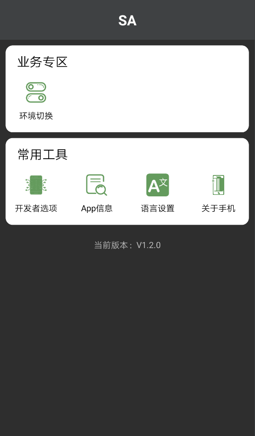
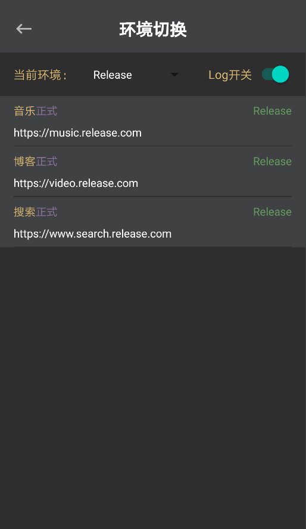

## Android开发调试框架-Apollo

[](https://www.apache.org/licenses/LICENSE-2.0)
[](https://github.com/eonliu/Apollo)
[](https://android-arsenal.com/api?level=16)

Apollo致力于简化Android调试工作。



## 使用方式

#### 1.在build.gradle中添加依赖
```groovy
implementation 'com.eonliu.apollo:apollo-kernel:1.2.2'          // 核心模块
annotationProcessor 'com.eonliu.apollo:apollo-compiler:1.2.2'   // 注解处理模块
debugImplementation 'com.eonliu.apollo:apollo-ui:1.2.2'         // UI操作模块
```

### 2.Apollo API
```java
// Log开关
Apollo.logEnable();
// 设置Log的默认状态，默认是关闭状态，可以使用BuildConfig.DEBUG进行初始化。这样当打debug包的时候就可以默认打印日志了。
// 如果你使用了startup库，则需要先初始化ApolloInitializer。
Apollo.setLogEnable(boolean enable);
```

### 3.配置环境信息
```java
/**
 * 支持模块化项目
 * 定义服务器地址信息，Name注解定义所有地址属于哪一功能模块，最终会生成AppEnvironments类。</p>
 * 在代码中通过生成的类获取具体的服务器地址。</p>
 * 例如要获取MUSIC的地址则应该使用{@code AppEnvironments.getMusicUrl()}方法获取。</p>
 * 在Release或非Release包中默认获取isRelease为true的url。</p>
 * 但在非Release包中如果手动切换过group，则每次重新启动会使用已选group当做默认地址。</p>
 * 目前单个功能模块的切换只支持运行时，重启之后会恢复成已选group的默认值。</p>
 */
@Name("app")
public final class AppConstants {

    // 预先定义服务器环境类别
    public static final String RELEASE = "Release";
    public static final String DEBUG = "Debug";
    public static final String DEVELOP = "Develop";
    public static final String CUSTOM = "Custom";

    // 每个Environment表示一种服务器地址，每个字段中可以使用多个Environment，但是必须有一个是isRelease的。
    @Environment(url = "https://music.release.com", desc = "正式", group = RELEASE, moduleName = "音乐", isRelease = true)
    @Environment(url = "https://music.debug.com", desc = "测试", group = DEBUG, moduleName = "音乐")
    String MUSIC;

    @Environment(url = "https://video.release.com", desc = "正式", group = RELEASE, moduleName = "博客", isRelease = true)
    @Environment(url = "https://video.debug.com", desc = "测试", group = CUSTOM, moduleName = "博客")
    @Environment(url = "https://video.develop.com", desc = "开发", group = CUSTOM, moduleName = "博客")
    @Environment(url = "https://video.custom.com", desc = "自定义", group = CUSTOM, moduleName = "博客")
    private String VIDEO;

}

/**
 * 定义另一个功能模块的服务器地址。（也可以统一定义在一类或接口个中）</p>
 * 此功能模块会生成{@code SearchEnvironments},获取SEARCH的方式是{@code SearchEnvironments.getSearchUrl()}
 */
@Name("search")
public interface SearchModule {

    @Environment(url = "https://www.search.release.com", desc = "正式", group = RELEASE, moduleName = "搜索", isRelease = true)
    @Environment(url = "https://www.search.debug.com", desc = "测试", group = CUSTOM, moduleName = "搜索")
    @Environment(url = "https://www.search.develop.com", desc = "开发", group = DEVELOP, moduleName = "搜索")
    String SEARCH = "";
}
```

### 4.获取服务器地址
```java
Logger.d(String.format("音乐地址 >>> %s", AppEnvironments.getMusicUrl()));
Logger.d(String.format("视频地址 >>> %s", AppEnvironments.getVideoUrl()));
Logger.d(String.format("搜索地址 >>> %s", SearchEnvironments.getSearchUrl()));
```

### 5.切换服务器地址
Apollo会在系统桌面提供一个快捷入口，点击此入口进入操控页面，选择"环境切换"即可进行服务器的动态切换。



### 6.TODO LIST
- log日志记录
- 摇一摇开启
- 环境切换优化
- 自定义开关

## License
```
Copyright 2020 eonliu

Licensed under the Apache License, Version 2.0 (the "License");
you may not use this file except in compliance with the License.
You may obtain a copy of the License at

   http://www.apache.org/licenses/LICENSE-2.0

Unless required by applicable law or agreed to in writing, software
distributed under the License is distributed on an "AS IS" BASIS,
WITHOUT WARRANTIES OR CONDITIONS OF ANY KIND, either express or implied.
See the License for the specific language governing permissions and
limitations under the License.
```
